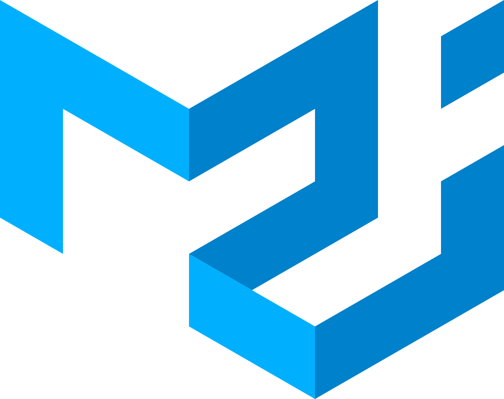
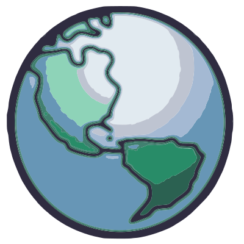
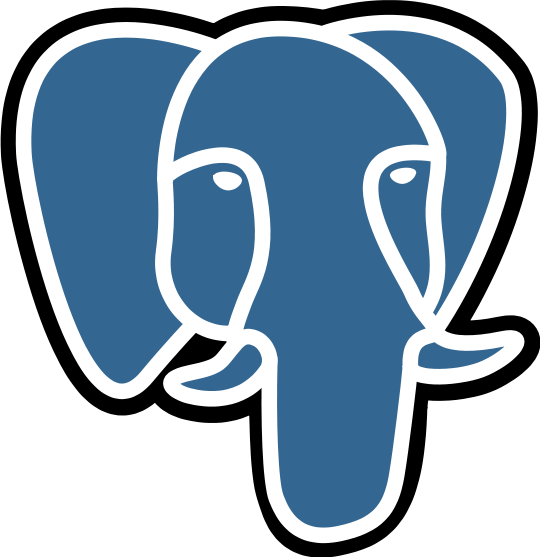

# System architecture

In this section, we outline the system architecture using ER Diagrams, Software Component Diagrams etc. and key libraries / frameworks used in this project.

## Software components used
<!-- These are generic. Customise as needed per project -->

The following is a list, with brief descriptions, of the key components used in creating this platform. Please refer to their individual documentation for in-depth technical information.

| Logo | Name | Notes |
|------------|---------|----------------|
|{: style="height:30px;width:30px"} | [Django](https://djangoproject.com) | Django makes it easier to build better web apps more quickly and with less code. | 
|{: style="height:30px;width:30px"}| [ReactJS](https://react.dev/) | React lets you build user interfaces out of individual pieces called components. Create your own React components like `Thumbnail`, `LikeButton`, and `Video`. Then combine them into entire screens, pages, and apps.|
| {: style="height:30px;width:30px"}   | [MUI](https://mui.com/)| Move faster with intuitive React UI tools. MUI offers a comprehensive suite of free UI tools to help you ship new features faster. Start with Material UI, our fully-loaded component library, or bring your own design system to our production-ready components. |
| {: style="height:30px;width:30px"} | [Docker](https://docker.com) | Accelerate how you build, share, and run applications. Docker helps developers build, share, and run applications anywhere — without tedious environment configuration or management. |
| {: style="height:30px;width:30px"} | [Celery](https://docs.celeryq.dev) | Celery is a simple, flexible, and reliable distributed system to process vast amounts of messages, while providing operations with the tools required to maintain such a system. It’s a task queue with focus on real-time processing, while also supporting task scheduling. |
| {: style="height:30px;width:30px"} | [Celery Beat](https://github.com/celery/django-celery-beat) | This extension enables you to store the periodic task schedule in your database. The periodic tasks can be managed from the Django Admin interface, where you can create, edit and delete periodic tasks and how often they should run. |
| {: style="height:30px;width:30px"} | [Django Rest Framework](https://www.django-rest-framework.org/) | Django REST framework is a powerful and flexible toolkit for building Web APIs. |
| {: style="height:30px;width:30px"} | [MapLibre](https://maplibre.org/)  | Open-source mapping libraries for web and mobile app developers. |
| {: style="height:30px;width:30px"} |  | deck.gl is a WebGL-powered framework for visual exploratory data analysis of large datasets. |
| {: style="height:30px;width:30px"} | [PostGIS](https://postgis.net/) | PostGIS extends the capabilities of the PostgreSQL relational database by adding support storing, indexing and querying geographic data. |
| {: style="height:30px;width:30px"} | [PostgreSQL](https://www.postgresql.org/) | PostgreSQL is a powerful, open source object-relational database system with over 35 years of active development that has earned it a strong reputation for reliability, feature robustness, and performance.  |
| {: style="height:30px;width:30px"} | [Tegola](https://tegola.io/) | An open source vector tile server written in Go, Tegola takes geospatial data and slices it into vector tiles that can be efficiently delivered to any client. |
| {: style="height:30px;width:30px"} | [GDAL](https://gdal.org) | GDAL is a translator library for raster and vector geospatial data formats that is released under an MIT style Open Source License by the Open Source Geospatial Foundation. As a library, it presents a single raster abstract data model and single vector abstract data model to the calling application for all supported formats. It also comes with a variety of useful command line utilities for data translation and processing.  |

## Docker components

The following diagram represents the docker containers, ports and volumes that are used to compose this platform.
<!-- To be generate per project -->

## ER diagram
<!-- To be generated per project -->

The following diagram represents all of the database entities that are created by the Django ORM (Object Relational Mapper). Right click the image and open it in its own tab to see it at full resolution.

<!-- Either add an image or add a link -->

🪧 If you already have all of the above criteria met, you can move on to [Prerequisites](prerequisites.md) to start the process of getting your local development environment set up.
