# Setting up your IDE

This section outlines the process for configuring your IDE for development.

🚩 Make sure you have gone through the [Cloning Section](cloning.md) before following these notes.

## VS Code setup

Open the project in VSCode (1️⃣, 2️⃣) by navigating the the place on your file system where you checked out the code in the pre-requisites step above (3️⃣).


Accept the 'trust authors' prompt

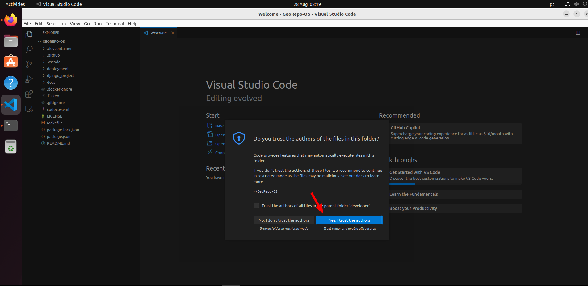

### Copying the .env

Copy the `template.env` to `.env`

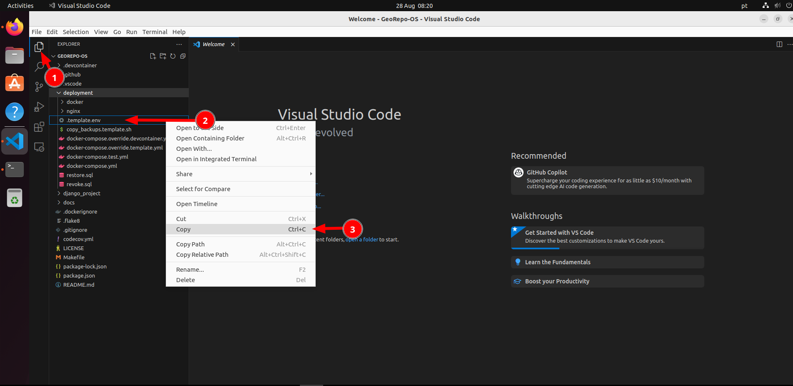

Edit the `.env` file and change the

```
DJANGO_SETTINGS_MODULE=core.settings.prod
```

to

```
DJANGO_SETTINGS_MODULE=core.settings.dev
```


### Override Docker configurations

We are going to copy the docker overrides template to a local file that will not be under version control.

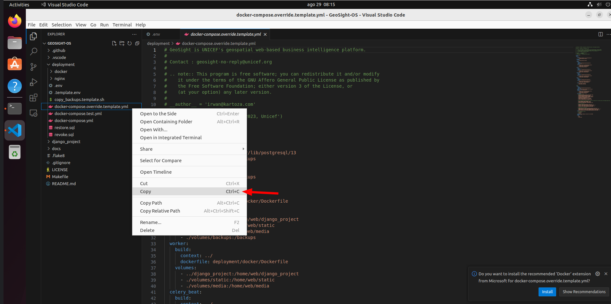

Rename the file to `docker-compose.override.yml`

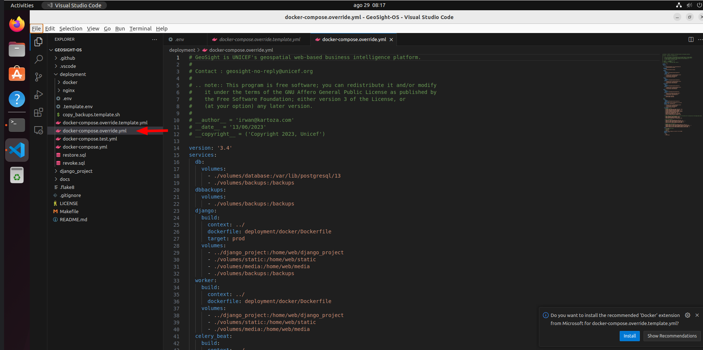

Initially you will not need to change anything in this file, though you may want to take a look through the various configurations provided here if you want to tweak your local setup.

Now that you have your IDE set up, we can move on to [building the project](building.md).

## Using PyCharm

📒 ⛔️ This section needs to be reviewed and organised into our docs framework.

This section is for using pycharm.

Requirements:

- Pycharm
- Finished **Setting up the project**

## Setup interpreter

1. Go to File -> Settings -> Project -> Project Interpreter. Then click on the cog -> add
   <br>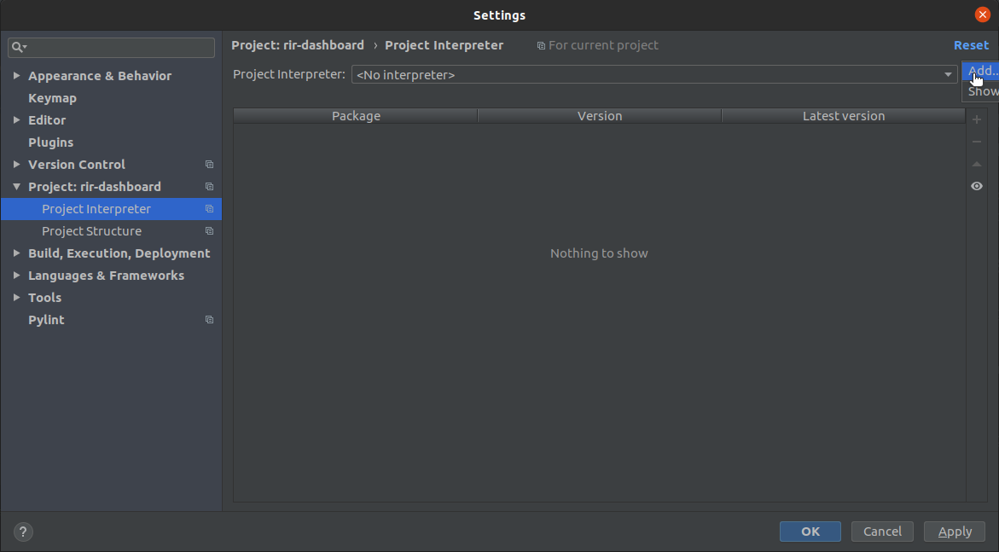<br><br>

2. Go to the ssh interpreter tab and fill in the form as below
   <br>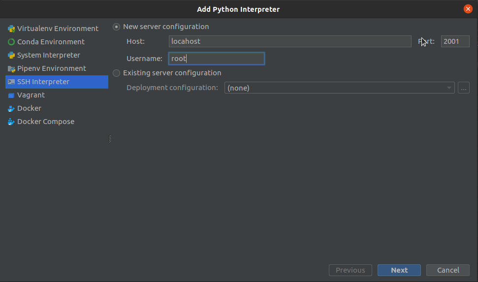<br><br>

3. Click next and fill in **docker** as the password
   <br>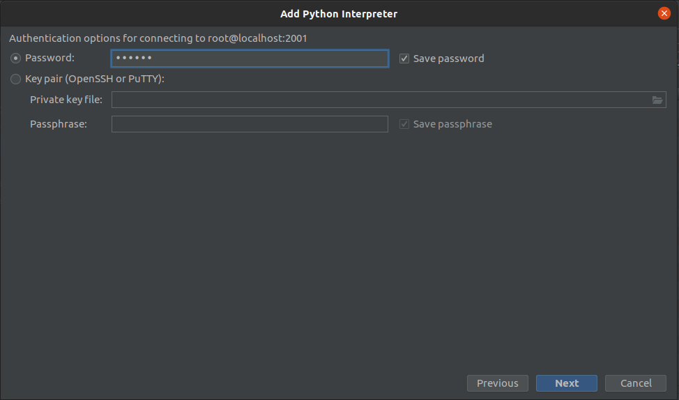<br><br>

4. Click next and change the interpreter as below, then click finish.
   <br>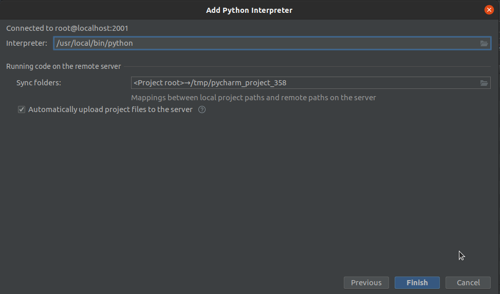<br><br>

5. After you click finish, it will show all of the packages like below.
   <br>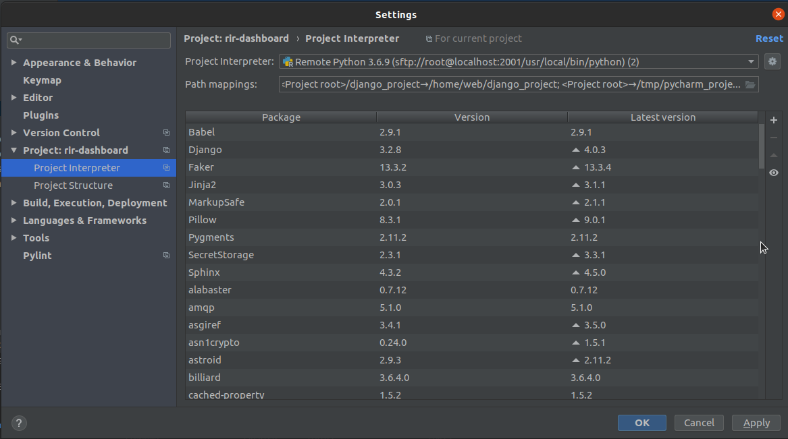<br><br>

6. In current page, click **path mappings**, click + button and put local path to where the project (django-project folder) and remote path is like below. and click oK.
   <br>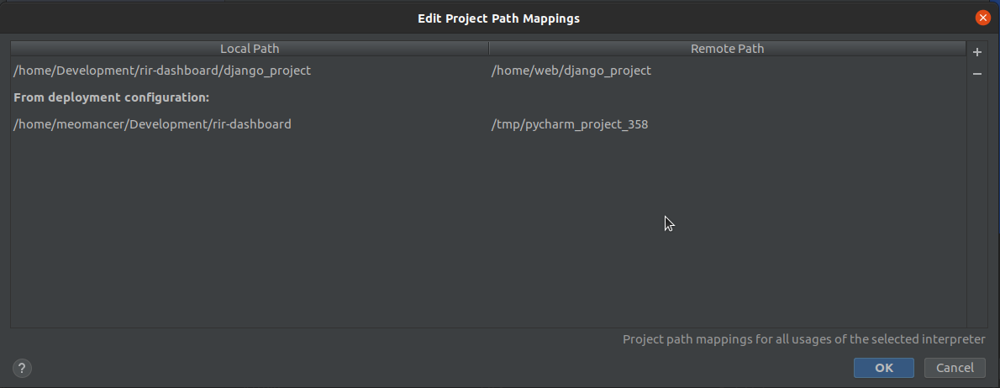

Now the interpreter is done. When we restart the machine, we need to do `make up` to run the project.

## Setup run configuration

After the interpreter is done, we need configuration to run the project in development mode.

1. Click "Add configuration" like in the cursor in the image below. (top-right)
   <br><br><br>

2. There will be a popup, and click +, then click **django server** like below
   <br>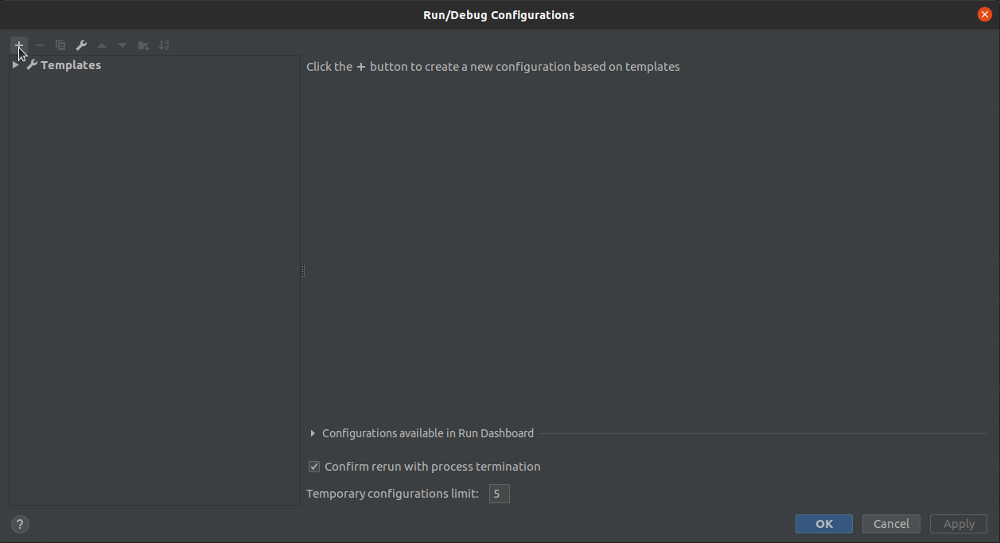
   <br>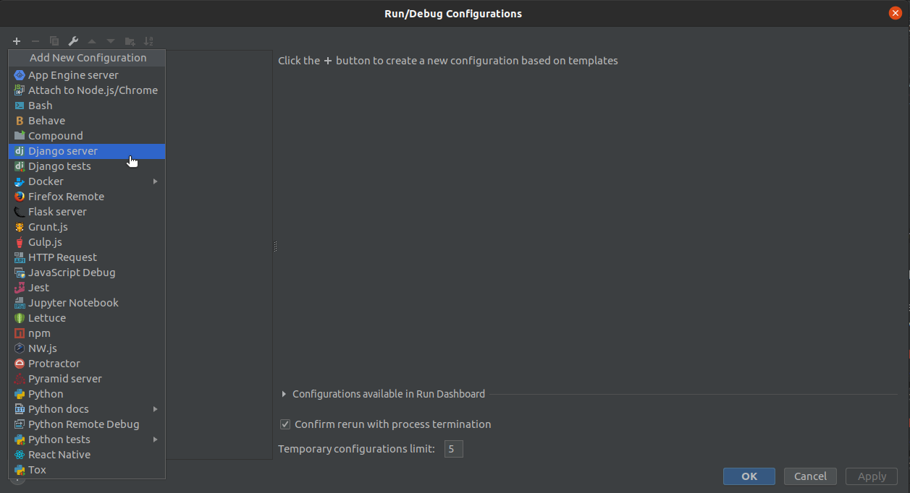<br><br>

3. It will show the form and fill like below.
   <br>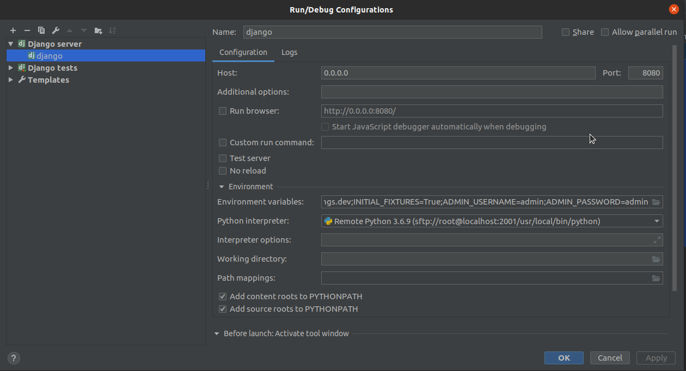<br><br>

4. Don't click the OK yet, but click **Environment Variables** and add environments like below (by clicking + button).
   <br>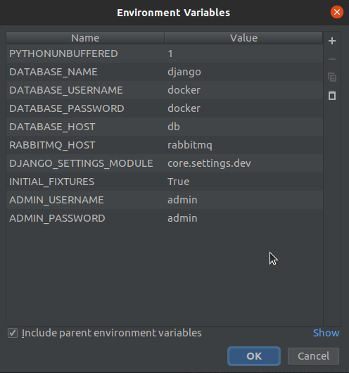<br><br>

5. After that, click OK.

6. Now we need to run the server by clicking **go** button in below image.
   <br>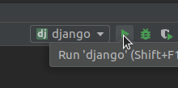<br><br>

7. When we click the **go** button, pycharm will run a process until like image below.
   <br>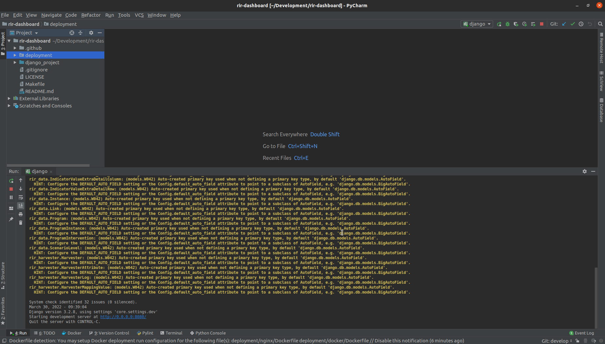<br><br>

8. Now it is done. We can access the development server in [http://localhost:2000/](http://localhost:2000/)

This development mode is DEBUG mode, and also whenever we change the code, the site will also change in runtime.

For more information how to set up on pycharm, please visit [Using a Docker Compose-Based Python Interpreter in PyCharm](https://kartoza.com/en/blog/using-docker-compose-based-python-interpreter-in-)

## Quick setup guide

⛔️📒 This content needs to be reviewed and moved to the readme.

### Production

```
git clone https://github.com/project-name/repository
cd project-name/deployment
docker-compose up -d
```

The web will be available at `http://127.0.0.1/`

To stop containers:

```
docker-compose kill
```

To stop and delete containers:

```
docker-compose down
```

### Development

```
git clone https://github.com/project-name/repository
cd project-name/deployment
cp .template.env .env
cp docker-compose.override.template.yml docker-compose.override.yml
```

After that,

- open new terminal
- on folder root of project, do

```
make frontend-dev
```

Wait until it is done
when there is sentence "webpack xxx compiled successfully in xxx ms".<br>
After that, don't close the terminal.
If it is accidentally closed, do `make frontend-dev` again

Next step:
- Open new terminal
- Do commands below
```
make up
make dev
```

Wait until it is on.

The web can be accessed using `http://localhost:2000/`

If the web is taking long time to load, restart project-name_dev container by `make dev-reload`.<br>
The sequence should be `make frontend-dev`, after that run or restart project-name_dev. 

To stop dev:

```
make dev-kill
```

To reload container:

```
make dev-reload
```
