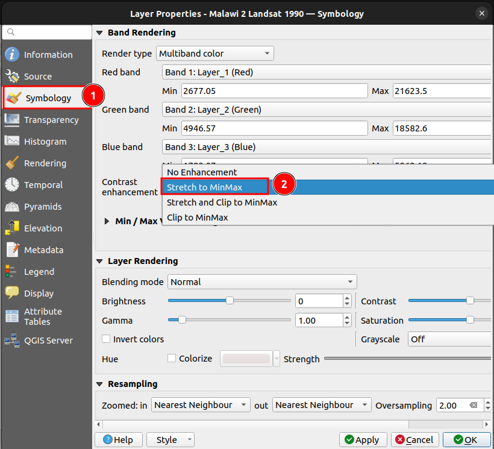
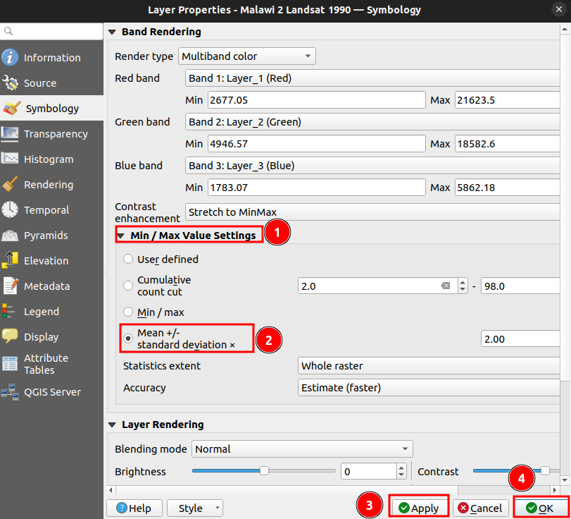

# Image Styling User Guide

This user guide will show you how to change the image styles in QGIS symbology to enhance the quality and realism of your images.

## Step 1: Open QGIS and Load Your Project

To get started, open QGIS and load your existing project. If you don't have a project open, you can create a new one by clicking on the `File` menu and selecting `New`.

# Step 2: Open the Layer Properties

In the Layers panel, right-click on the layer for which you want to change the symbology and select the 1️⃣ `Properties`. This will open the Layer Properties dialog box.

# Step 3: Open the Symbology Tab

In the Layer Properties dialog box, click on the 1️⃣ `Symbology` tab on the left side. This will open the Symbology settings. In the Symbology settings, locate the settings for contrast enhancement. In the contrast enhancement dropdown, select the 2️⃣ `Stretch to MinMax` option. This will adjust the contrast of the image to make it more visually appealing.

# Step 4: Configure Min/Max Value Settings

Click on the 1️⃣ `Min/Max value setting` to view more options. Choose the 2️⃣ `Mean +/- standard deviation` option. This will adjust the minimum and maximum values of the image to make it more realistic. Click on the 3️⃣ `Apply` to apply the changes and continue making adjustments. Alternatively, click on the 4️⃣ `OK` to apply the changes and close the Layer Properties window.

## Conclusion

By following these steps, you can change the image styles in QGIS symbology to enhance the quality and realism of your images. Remember to experiment with different settings and have fun with the image styling options!
