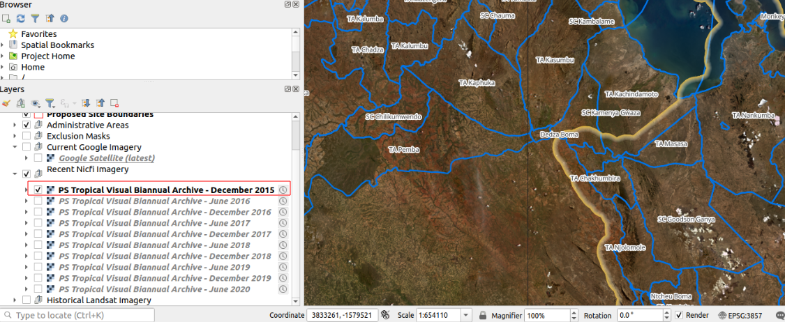
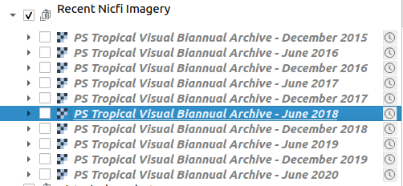

# NICFI Imagery User Guide Tutorial

## Introduction

This tutorial will guide you through accessing and using NICFI (Norway's International Climate & Forests Initiative) imagery in QGIS. NICFI imagery provides high-resolution, analysis-ready mosaics of the world's tropics, supporting efforts in forest conservation, climate change mitigation, and sustainable development.

## Prerequisites

- QGIS installed on your computer. If the QGIS is not already installed on your system click [here](../quickstart/index.md) for the detailed documentation on the QGIS installation.

- An account on the Planet Explore site.

## Step 1: Register and Log in to Planet Explore

1. If you haven't already, register for an account on the Planet Explore site. Follow the instructions in the [Register for the Planet Explore site](./sign-up.md) document.

2. Once registered, log in to your account using the guide in the [Login to the Planet Explore site](./login.md) document.

## Step 2: Access NICFI Imagery in QGIS

1. Open your QGIS project.
2. Locate the layer list in your QGIS interface.

## Step 3: Disable Current Google Imagery/Historical Landsat Imagery

1. Uncheck the `Current Google Imagery` and `Historical Landsat Imagery` checkbox in the layer list to view the Nicfi imagery.

## Step 4: Enable NICFI Imagery

1. Check the 1️⃣ `Recent Nicfi Imagery` checkbox in the layer list to enable NICFI imagery.

## Step 5: Select NICFI Imagery

1. After enabling NICFI imagery, you will see a list of available imageries.
2. Choose the imagery you want to view on the map canvas.

## Step 6: Explore Available NICFI Imagery

NICFI provides biannual imagery archives. Here are the available options:

- December 2015
- June 2016
- December 2016
- June 2017
- December 2017
- June 2018
- December 2018
- June 2019
- December 2019
- June 2020

Each imagery set provides a visual representation of the tropical regions for that specific time period.

## Step 7: Analyse and Use the Imagery

1. Once you have selected an imagery, it will appear on your map canvas.

2. Use QGIS tools to analyse the imagery, such as:
   - Zoom in/out to examine areas of interest.
   - Use Pan to pan on the map canvas.
   - See the tips usign the show map tips.

## Tips for Using NICFI Imagery

1. **Compare Time Periods**: Use different imagery dates to observe changes in tropical forests over time.
2. **Combine with Other Data**: Overlay the NICFI imagery with other geographic data for comprehensive analysis.
3. **Performance Optimization**: Remember that NICFI imagery is streamed on demand. If you experience slow loading, try zooming in to a smaller area or checking your internet connection.

## Conclusion

NICFI imagery provides a powerful tool for analysing tropical regions. By following this guide, you can effectively access and utilise this valuable resource in your QGIS projects, supporting efforts in forest conservation, climate change mitigation, and sustainable development.

Remember, NICFI imagery is for non-commercial use only. Always comply with the usage terms and conditions set by NICFI and Planet.