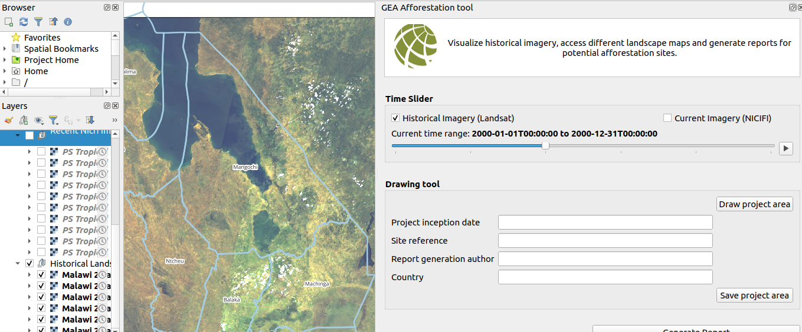
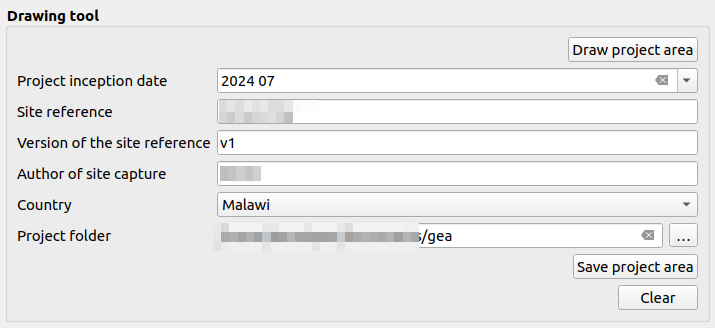
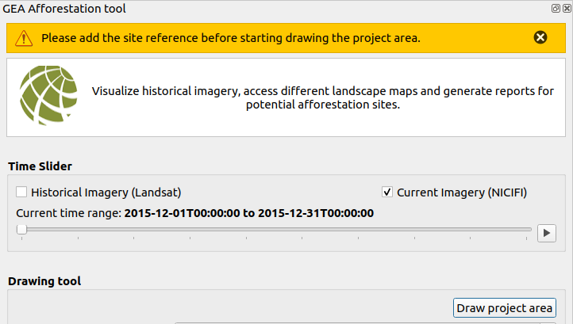
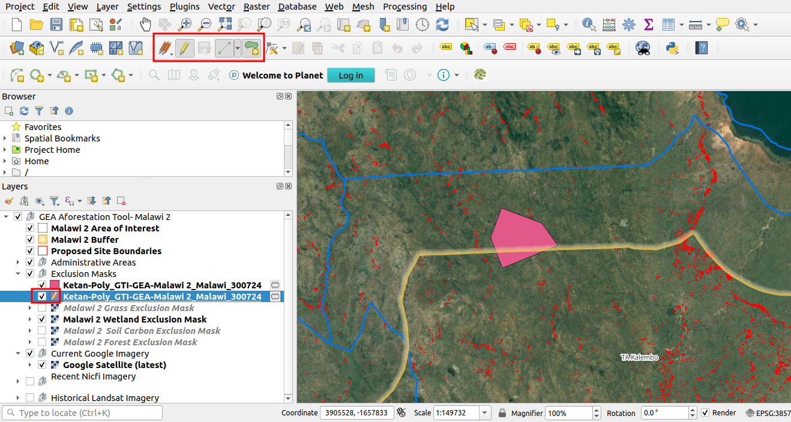

# GEA Reforestation Tool User Manual

Welcome to the GEA Reforestation Tool user manual. This guide will help you navigate and utilise the tool to visualise historical imagery, access different landscape maps, and generate reports for potential afforestation sites.

## Overview

The GEA Reforestation Tool is designed to assist users in identifying and evaluating potential afforestation sites by providing access to various historical and current landscape imagery. Key features of the tool include:

- Visualisation of historical imagery (Landsat)
- Visualisation of current imagery (NICFI)
- Interactive map canvas
- Report generation for potential afforestation sites

**Features and Controls**

1. **Historical Imagery (Landsat):** If checked the map canvas will display historical imagery from Landsat.

2. **Current Imagery (NICFI):** If checked the map canvas will display current imagery from NICFI.

3. **Slide Bar:** The slide bar allows users to view the selected imagery on the map canvas. The functionality of the slide bar depends on the checkbox selection:

    - **Historical Imagery Checkbox Checked:** The map canvas will display historical imagery from Landsat.

    

    - **Current Imagery Checkbox Checked:** The map canvas will display current imagery from NICFI.

    

    The user can use the slide bar by dragging the toggle to the next or previous increment to view the corresponding imagery on the map canvas.

4. **Play Button:** The play button allows users to play through the selected imagery. This feature is useful for visualising changes in the landscape over time.

    **Historical Imagery**

    

    **Current Imagery**

    

5. **Drawing tool:** The user can use the drawing tool to draw polygons on the map canvas.
        
    

    5.1 **Draw Project Area Button:** The user can use this button to draw the polygon on the map canvas. Before using the `Draw Project Area` button, ensure that the site reference has been provided. After drawing the polygon right click. Upon clicking the pop up will open for entering the id, id should be 1.

    

    - **Error Handling:** If any of the field is empty, an error message will be displayed for example for the site reference field the message would be: `Please add the site reference before starting drawing the project area.`

        

    - **Editing:** After drawing the polygon, you can edit it using the options available in the toolbar. The edit icon will appear in front of the project in the layer list, allowing modifications before saving.

        

    5.2 **Project Inception Date:** To choose the project inception date, click on the field to open a calendar. Select the desired date from the calendar interface.

    

    5.3 **Site Reference:** Enter the site reference to identify the specific location or area for the project.

    5.4 **Version of the Site Reference:** Add the version number corresponding to the site reference for version control and tracking.

    5.5 **Author of the Site Capture:** Enter the name of the individual who captured or recorded the site details.

    5.6 **Country Dropdown:** Choose the country from the dropdown list to specify the location of the project.
    
    5.7 **Project Folder:** Select the project folder where plugin data is stored. The shape files will be saved in the `sites` directory, which is automatically generated when you save the project.

    

    5.8 **Save Project Area Button:** Click the `Save Project Area` button to save the project after drawing the polygon. The shape files will be stored in the `sites` directory.

    5.9 **Clear Button:** Use the `Clear` button to remove the polygon from the map. Note that the polygon must be cleared before saving the project, as shape files stored in the sites folder will not be deleted after saving.
