# GEA Reforestation QGIS Plugin User Manual

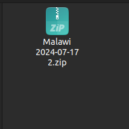

1. **Preparing the QGIS Project:** To start using the GEA Reforestation Tool, you need to extract the project folder shared by the Head office.

    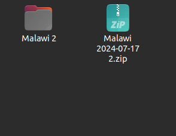

    After extracting the .zip folder the extracted folder will show in the location you have specified. Click on the extracted folder to view the files/folders inside. The project folder should contain the following files/folders:

    * Masks: This folder contains Exclusion Masks data.
    * Images: This folder contains historical Landsat imagery data.
    * Malawi_2.gpkg: This is a package for vector data.
    * QGIS project file (project.qgz): This is the main file that contains the QGIS project settings.
    * Plugin.zip: this contains the GEA reforestation tool to be loaded in QGIS

    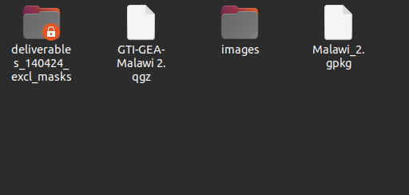

3. **Opening the QGIS Project:** If the user does not have QGIS installed, please refer to the complete documentation on how to [install QGIS](../quickstart/index.md). 

    - Once installed, right-click on the project.qgz file and select `Open with QGIS` to open the project.

        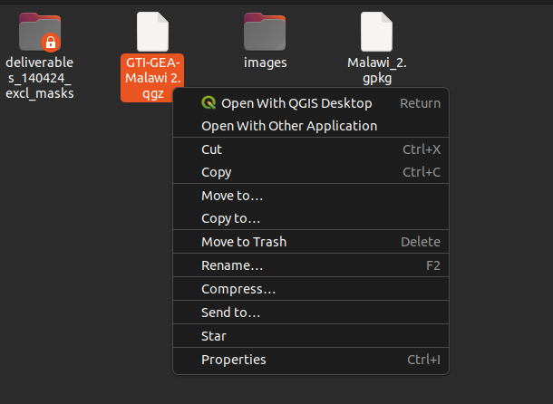

4. **Navigating the QGIS Interface:** The QGIS interface is divided into several useful areas:

    3.1 **Menu Toolbar**
    The menu toolbar offers many options, some of which are:

    * **Settings:** The user can use the settings option for managing the user profile, style and many more.

        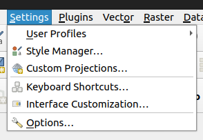

    * **Plugins:** The user can use the plugin option to manage plugins like installing, uninstalling, and upgrading plugins.

        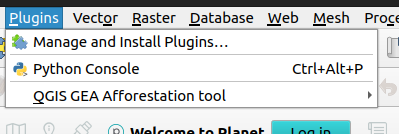

    3.2 **Icon Toolbar**

    

    The map navigation toolbar offers many options, some of which are:

    1. **Pan:** Allows the user to pan the map to a specific location.
    2. **Zoom in:** Zooms in on the map to show more detail.
    3. **Zoom out:** Zooms out of the map to show a wider area.
    4. **Full zoom:** Zooms in or out to the maximum extent.
    5. **Show map tips:** Displays additional information about the map, such as coordinates and scale.

    3.3 **Digitising Toolbar:**

    

    The digitising toolbar offers many options, some of which are:

    1. **Current edits:** Displays the current editing state of the layer.
    2. **Toggle editing:** Toggles the editing mode on or off.
    3. **Save layer edits:** Saves any changes made to the layer.
    4. **Add polygon feature:** Creates a new polygon feature on the map.

    ### 3.4 Layer List

    The user can use the QGIS project with emphasis on the Layers List panel to contextualise and review the area of interest. The Layers List for all of the areas of interest (`Malawi 2` shown here) includes the following:

    

    - Malawi 2 Area of Interest
    - Malawi 2 Buffer
    - Proposed Site Boundaries
    - Gea Afforestation Tool-Malawi 2
    - Administrative Areas
    - Exclusion Masks
    - Current Google Imagery
    - Recent NICFI Imagery
    - Historical Landsat Imagery

    1. **Malawi 2 Area of Interest:** Check the `Malawi 2 Area of Interest` checkbox to visualise the area of interest, it will be shown on the map canvas with a black line.

    

    2. **Malawi 2 Buffer:** Check the `Malawi 2 Buffer` checkbox to visualise the buffer area, it will be shown on the map canvas with a yellow line.

    

    3. **Proposed Site Boundaries:** Displays the proposed boundaries created by the user for the project. Check the `Proposed Site Boundaries` checkbox and the proposed boundaries will be shown on the map canvas with a red line.

    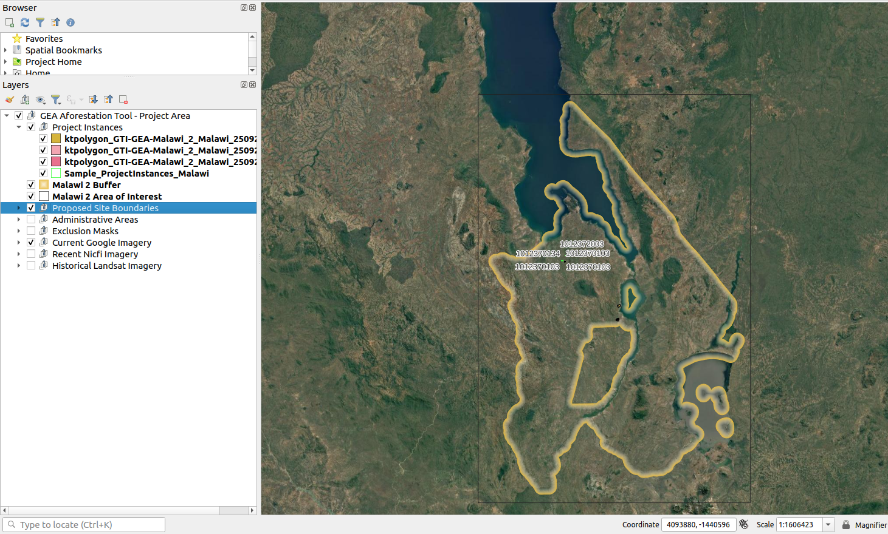

    4. **Administrative Areas:** This includes three options with checkboxes that allow users to visualise different administrative areas on the map canvas.

    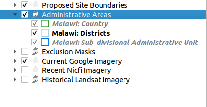

    - **Malawi 2 Country:** Displays the country boundaries of Malawi. Check the `Malawi 2 Country` checkbox to visualise the country boundaries, it will be shown on the map canvas with a green administrative boundary line.

        

    - **Malawi 2 District:** Displays the district boundaries within Malawi. Check the `Malawi 2 District` checkbox to visualise the district boundaries, it will be shown on the map canvas with a white line. Zoom in to view this on the map canvas.

        

    - **Malawi 2 Sub-divisional Administrative Unit:** Displays the sub-divisional administrative units within Malawi. Check the `Malawi 2 Sub-divisional Administrative Unit` checkbox to visualise the sub-divisional administrative unit boundaries, it will be shown on the map canvas with a blue line. Zoom in further after the district boundaries are shown on the map canvas to view the sub-divisional administrative units.

        

    5. **Exclusion Masks:**

    

    There are four exclusion masks available for the user. The user can use these exclusion masks to check where they cannot do a project. To use the exclusion mask, check the checkbox available in front of the exclusion mask. The four exclusion masks are:

    **Malawi 2 Grass Exclusion Mask**
        

    **Malawi 2 Wetland Exclusion Mask**
        

    **Malawi 2 Forest Exclusion Mask**
        

    **Malawi 2 Soil Carbon Exclusion Mask**
        

    > Additional Notes on Viewing Different Imagery Layers:
    To effectively view the different imagery layers (Google Imagery, NICFI, and Landsat), you need to toggle the visibility of these layers.

    6. **Current Google Imagery:** Displays the most recent Google imagery. Check the relevant checkbox to view `Current Google imagery`.

    

    7. **Recent NICFI Imagery:**

    - **Turn Off Google Imagery/Historical Landsat Imagery to View NICFI Imagery:** In the Layers panel, locate the Google Imagery/Historical Landsat Imagery layer. Click the checkbox next to the Google Imagery/Historical Landsat Imagery layer to turn it off. This will allow the NICFI imagery to be visible.

    

    Through Norway’s International Climate & Forests Initiative (NICFI), users can now access Planet’s high-resolution, analysis-ready mosaics of the world’s tropics in order to help reduce and reverse the loss of tropical forests, combat climate change, conserve biodiversity, and facilitate sustainable development for non-commercial uses.

    To use the NICFI imagery the user must log in to the Planet_Explorer plugin.

    For detailed documentation on how to log in click [here](./login.md)

    Displays recent NICFI imagery. Check the relevant checkbox to view recent NICFI imagery.

    
    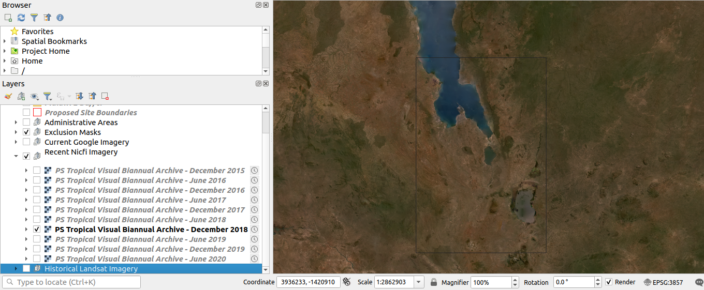

    8. **Historical Landsat Imagery:** Displays historical Landsat imagery. Check the relevant checkbox to view historical Landsat imagery. The user can use the historical imagery to compare the current and historical imagery differences.

    - **Turn Off Google Imagery/NICFI Imagery to View Landsat Imagery:** In the Layers panel, locate the Google Imagery/NICFI imagery layer. Click the checkbox next to the Google Imagery/NICFI imagery layer to turn it off. This will reveal the Landsat imagery layer below.

    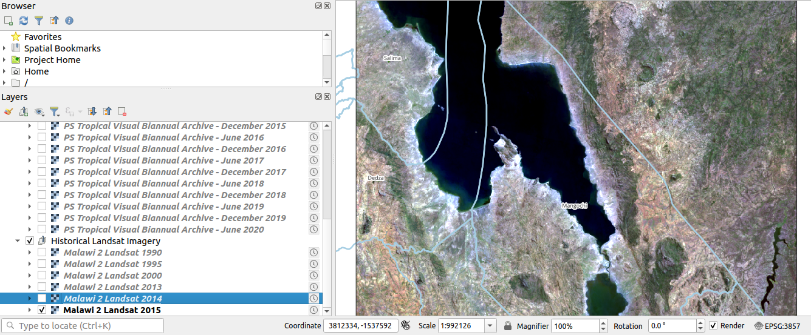

    By using the layers list effectively, the user can customise the visualisation of different layers and gain valuable insights for the project.

    ### 3.5 Map Canvas

    The map canvas is the main area where the user can view and interact with the map. Users can use the map canvas to:

    * Zoom in and out using the zoom tools.
    * Pan the map using the pan tool.
    * Identify features on the map using the identify tool.
    * Add new features to the map using the vector toolbar.

    By following these steps and using the various tools and options in the QGIS interface, the user can effectively use the GEA Reforestation QGIS Plugin to manage and analyse your reforestation project data.

### How to change the image styles in QGIS symbology

**To change the image styles in QGIS symbology, follow these steps:**

Open QGIS and Load your Project: Start QGIS and open your existing project.

1. **Select the Layer Properties:** In the Layers panel, right-click on the layer for which you want to change the symbology and select `Properties`.

2. **Open the Symbology Tab:** In the Layer Properties dialog, click on the `Symbology` tab on the left side.

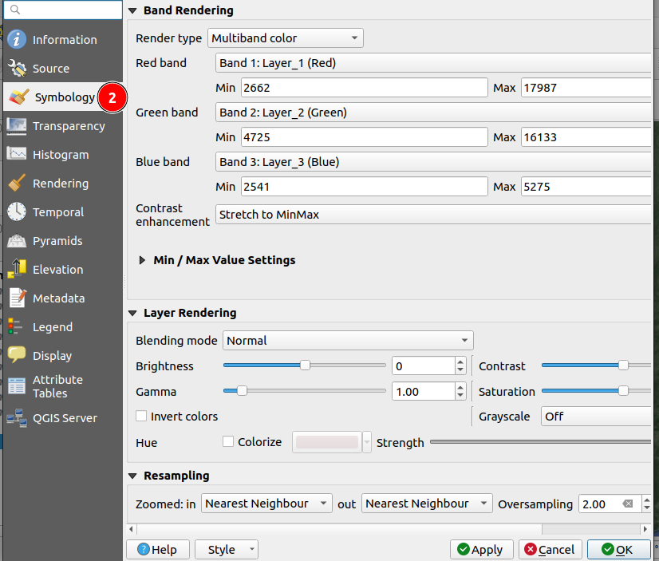

3. **Adjust Contrast Enhancement:** Locate the settings for contrast enhancement. In the contrast enhancement dropdown, select the `Stretch to MinMax"` option.

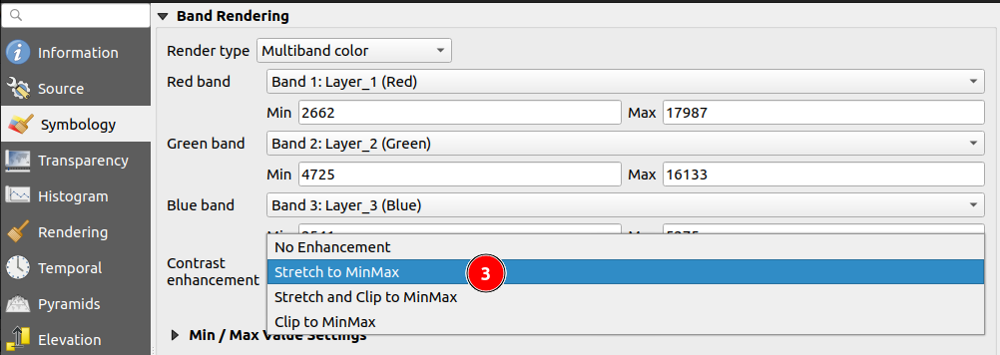

4. **Configure Min/Max Value Settings:** Click on the `Min/Max value setting` to view more options. Choose the `Mean +/- standard deviation` option.

5. **Apply/OK Button:** Click `Apply` to apply the changes and continue making adjustments. Alternatively, click `OK` to apply the changes and close the Layer Properties window.

By following these steps, the user can enhance the image quality and make it appear more realistic.
