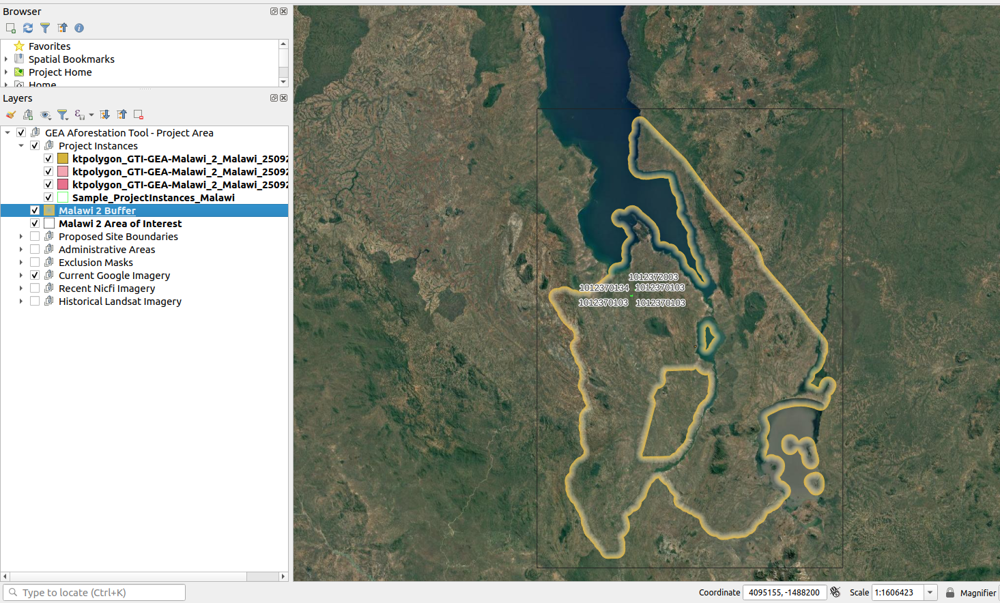
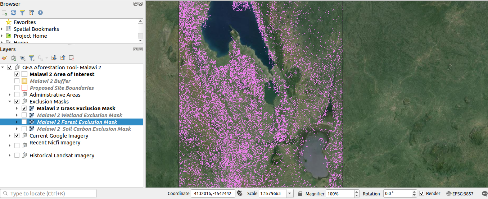
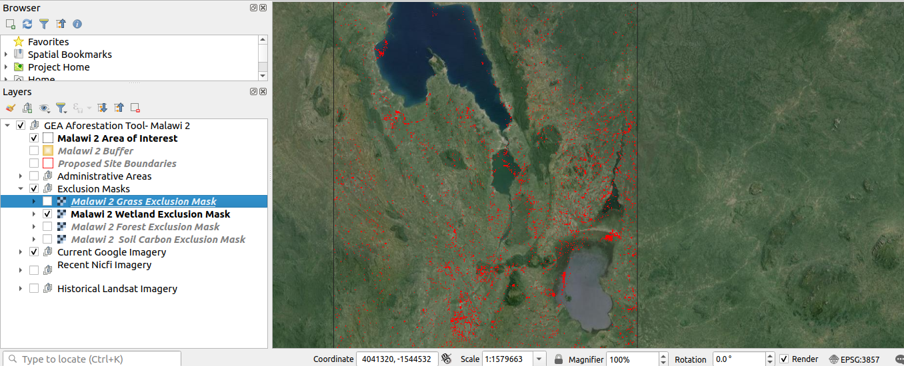
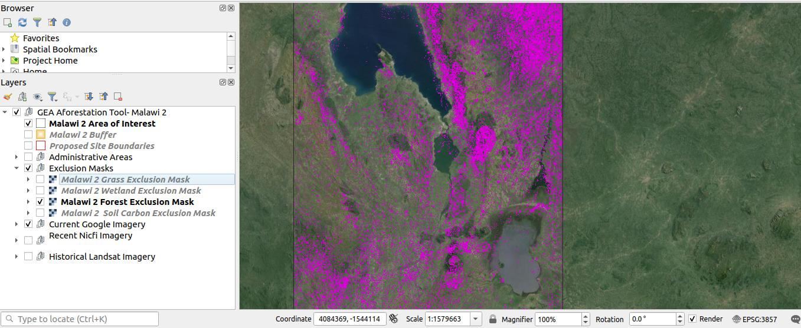
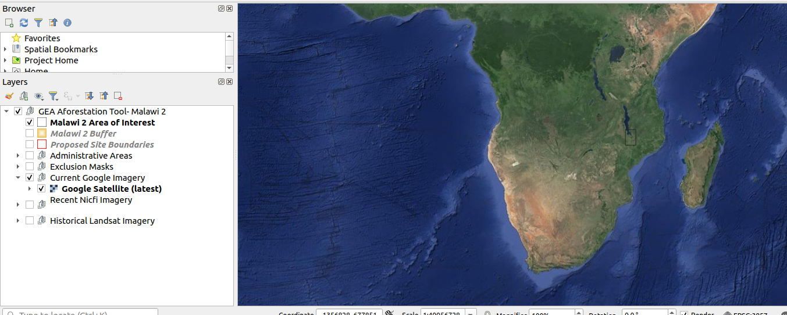

# User Manual: QGIS Project

This user manual provides instructions on how to use the QGIS project with emphasis on the Layers List panel effectively. The Layers List for all of the areas of interest (`Malawi 2` shown here) includes the following :

- Malawi 2 Area of Interest
- Malawi 2 Buffer
- Proposed Site Boundaries
- Gea Afforestation Tool-Malawi 2
- Administrative Areas
- Exclusion Masks
- Current Google Imagery
- Recent NICFI Imagery
- Historical Landsat Imagery

1. **Malawi 2 Area of Interest:** Check the `Malawi 2 Area of Interest` checkbox to visualise the area of interest, it will be shown on the map canvas with a black line.

2. **Malawi 2 Buffer:** Check the `Malawi 2 Buffer` checkbox to visualise the buffer area, it will be shown on the map canvas with a yellow line.

3. **Proposed Site Boundaries:** Displays the proposed boundaries created by the user for the project. Check the `Proposed Site Boundaries` checkbox and The proposed boundaries will be shown on the map canvas with a red line.

4. **Administrative Areas:** This includes three options with checkboxes that allow users to visualise different administrative areas on the map canvas.

- **Malawi 2 Country:** Displays the country boundaries of Malawi. Check the `Malawi 2 Country` checkbox to visualise the country boundaries, it will be shown on the map canvas with a green line.

    

- **Malawi 2 District:** Displays the district boundaries within Malawi. Check the `Malawi 2 District` checkbox to visualise the district boundaries, it will be shown on the map canvas with a white line. Zoom in to view this on the map canvas.

    

- **Malawi 2 Sub-divisional Administrative Unit:** Displays the sub-divisional administrative units within Malawi. Check the `Malawi 2 Sub-divisional Administrative Unit` checkbox to visualise the sub-divisional administrative unit boundaries, it will be shown on the map canvas with a blue line. Zoom in further after the district boundaries are shown on the map canvas to view the sub-divisional administrative units.

    

5. **Exclusion Masks:**

There are four exclusion masks available for the user. The user can use these exclusion masks to check where they cannot do a project. To use the exclusion mask, check the checkbox available in front of the exclusion mask. The four exclusion masks are:

**Malawi 2 Grass Exclusion Mask**
    

**Malawi 2 Wetland Exclusion Mask**
    

**Malawi 2 Forest Exclusion Mask**
    

**Malawi 2 Soil Carbon Exclusion Mask**
    

> Additional Notes on Viewing Different Imagery Layers:
To effectively view the different imagery layers (Google Imagery, NICFI, and Landsat), you need to toggle the visibility of these layers.

6. **Current Google Imagery:** Displays the most recent Google imagery. Check the relevant checkbox to view `Current Google imagery`.

7. **Recent NICFI Imagery:**

- **Turn Off Google Imagery/Historical Landsat Imagery to View NICFI Imagery:** In the Layers panel, locate the Google Imagery/Historical Landsat Imagery layer. Click the checkbox next to the Google Imagery/Historical Landsat Imagery layer to turn it off. This will allow the NICFI imagery to be visible.

Through Norway’s International Climate & Forests Initiative (NICFI), users can now access Planet’s high-resolution, analysis-ready mosaics of the world’s tropics in order to help reduce and reverse the loss of tropical forests, combat climate change, conserve biodiversity, and facilitate sustainable development for non-commercial uses.

To use the NICFI imagery the user must log in to the Planet_Explorer plugin.

For detailed documentation on how to log in click [here](./login.md)

Displays recent NICFI imagery. Check the relevant checkbox to view recent NICFI imagery.

8. **Historical Landsat Imagery:** Displays historical Landsat imagery. Check the relevant checkbox to view historical Landsat imagery. The user can use the historical imagery to compare the current and historical imagery differences.

- **Turn Off Google Imagery/NICFI Imagery to View Landsat Imagery:** In the Layers panel, locate the Google Imagery/NICFI imagery layer. Click the checkbox next to the Google Imagery/NICFI imagery layer to turn it off. This will reveal the Landsat imagery layer below.

By using the layers list effectively, the user can customise the visualisation of different layers and gain valuable insights for the project.
