**NICFI Imagery Documentation**

1. **What is NICFI Imagery?:** 

The NICFI (Norway's International Climate & Forests Initiative) imagery is a collection of high-resolution, analysis-ready mosaics of the world's tropics, provided by Planet. This imagery is designed to support non-commercial uses in reducing and reversing the loss of tropical forests, combating climate change, conserving biodiversity, and facilitating sustainable development.

2. **Why is NICFI Imagery not included in the project file?:**

Including the NICFI imagery in the project file would result in an extremely large file size, making it impractical for use. To address this, the imagery is streamed into the project on demand, allowing users to access the data without the need for a massive file size.

3. **How to access NICFI Imagery**

To use the NICFI imagery, you need to register and log in to the `Planet Explore` site. Please refer to the following documentation for detailed instructions:

* [Register for the Planet Explore site](./sign-up.md)

* [Login to the Planet Explore site](./login.md)

**Using NICFI Imagery in QGIS**

To use the NICFI imagery in QGIS, follow these steps:

**Uncheck the `Current Google Imagery` checkbox**

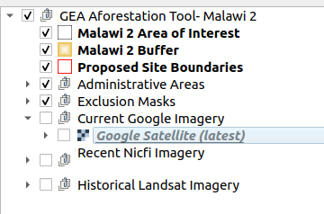

* Check the `Recent Nicfi Imagery` checkbox and then select the Nicfi imagery from the available imageries to view on the map canvas.

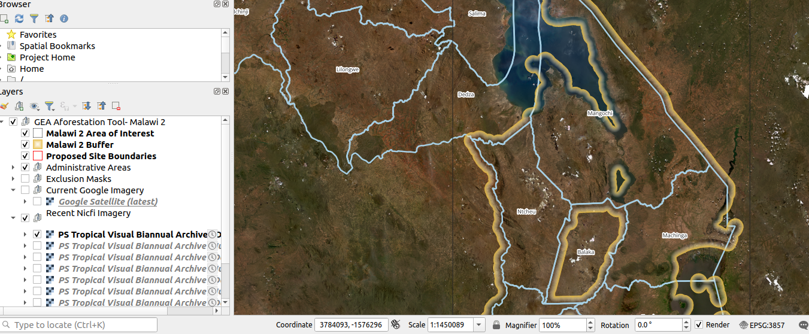

4. **Nicfi imageries**

**PS Tropical Visual Biannaul Archive - December 2015**

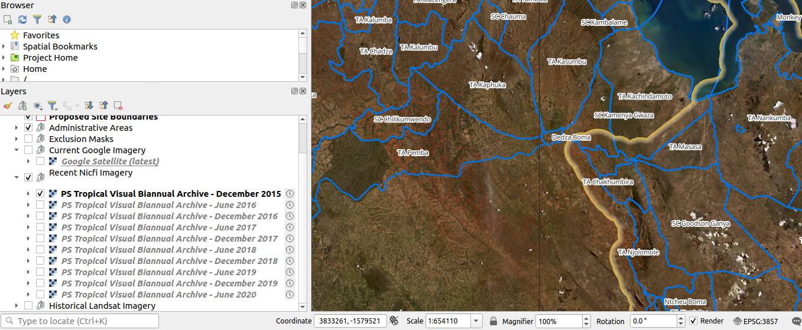

**PS Tropical Visual Biannaul Archive - June 2016**

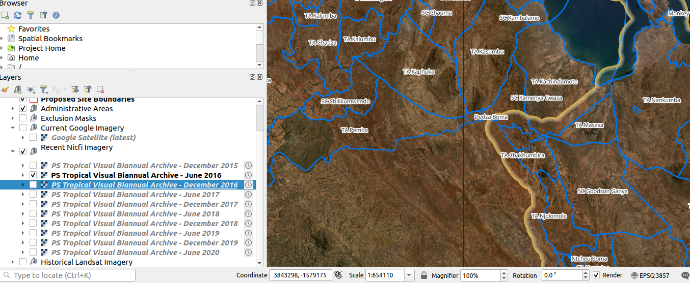

**PS Tropical Visual Biannaul Archive - December 2016**

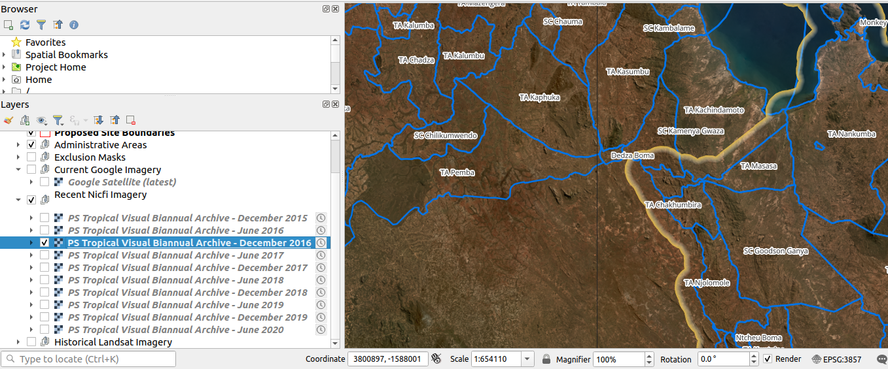

**PS Tropical Visual Biannaul Archive - June 2017**

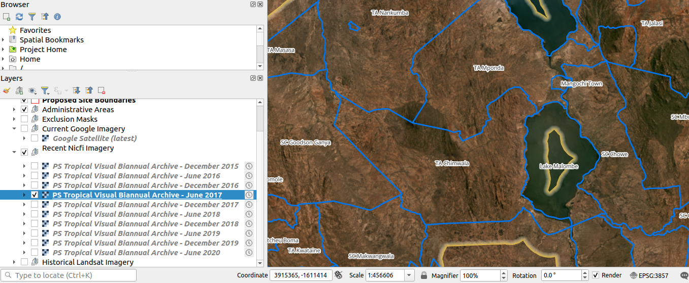

**PS Tropical Visual Biannaul Archive - December 2017**

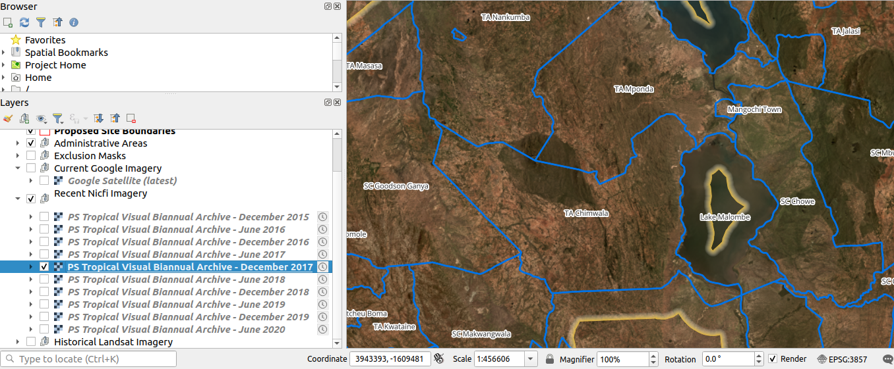

**PS Tropical Visual Biannaul Archive - June 2018**

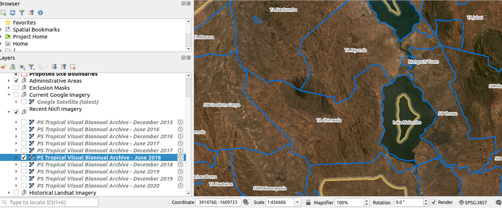

**PS Tropical Visual Biannaul Archive - December 2018**

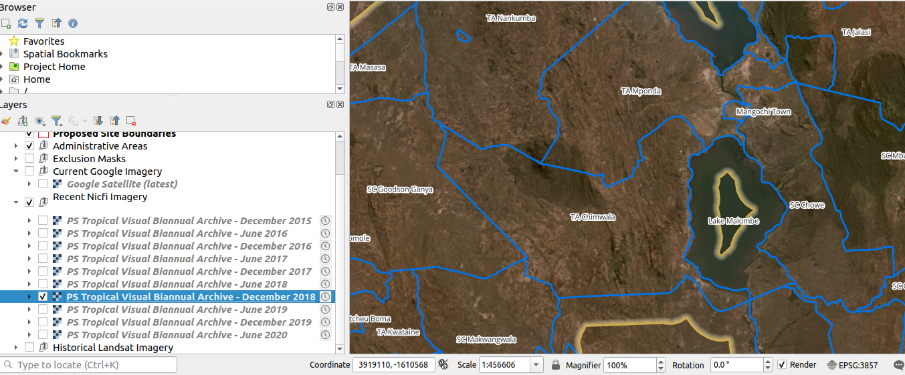

**PS Tropical Visual Biannaul Archive - June 2019**

**PS Tropical Visual Biannaul Archive - December 2019**

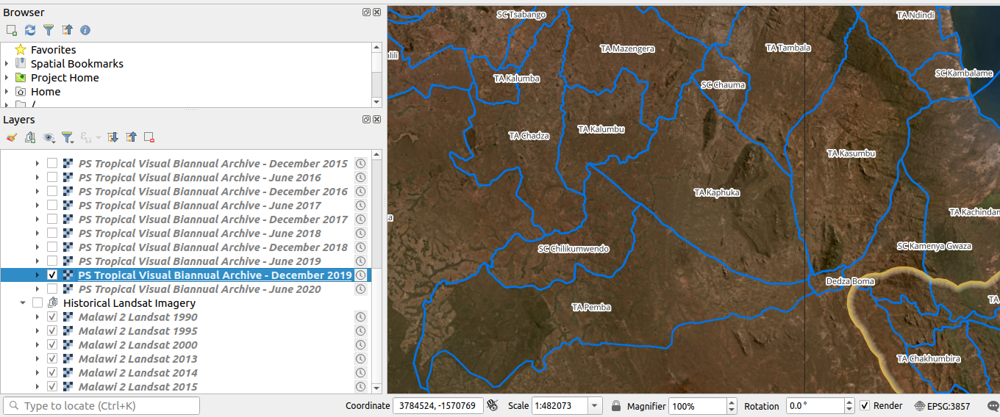

**PS Tropical Visual Biannaul Archive - June 2020**

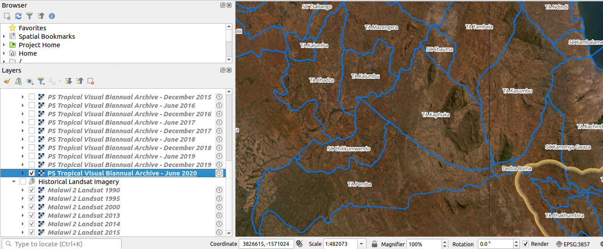

5. **Benefits of using NICFI Imagery:**

The NICFI imagery offers several benefits, including:

* High-resolution, analysis-ready mosaics of the world's tropics
* Support for non-commercial uses in reducing and reversing the loss of tropical forests, combating climate change, conserving biodiversity, and facilitating sustainable development
* Access to a large collection of imagery data without the need for a massive file size
* Ability to stream imagery on demand, reducing project file size and improving performance

By using the NICFI imagery, you can gain valuable insights into the world's tropical regions and support efforts to protect and conserve these critical ecosystems.