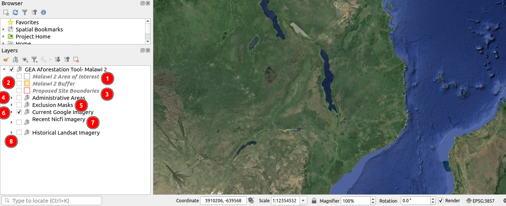
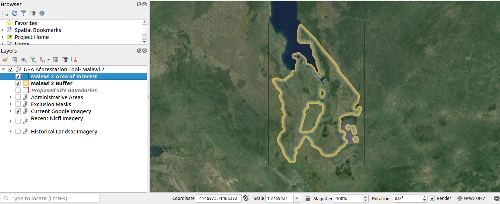
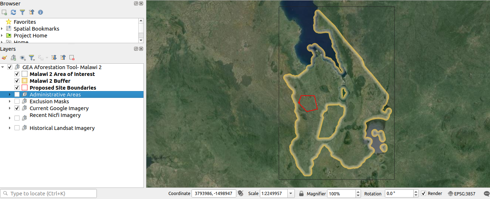
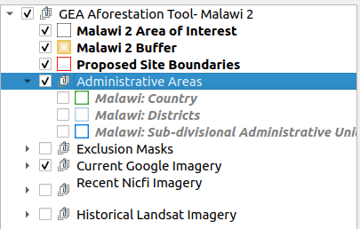
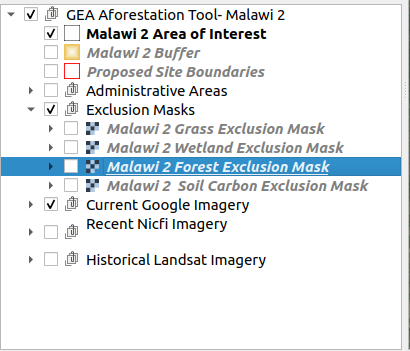
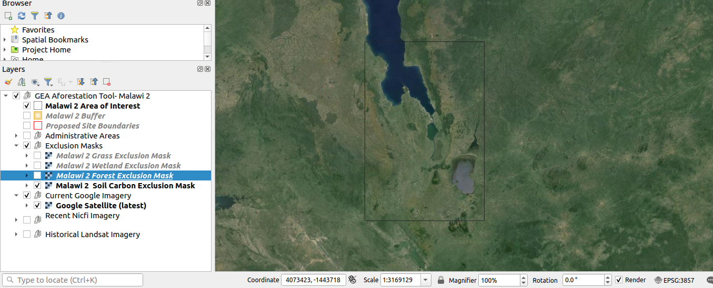
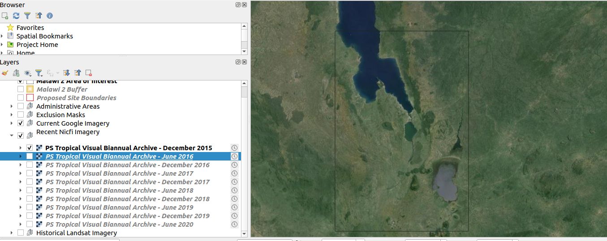

# User Manual: QGIS Project

This user manual provides instructions on how to use the QGIS project with emphasis on the Layers List panel effectively for the project. The Layers List for all of the areas of interest (`Malawi 2` shown here) includes the following :

- Malawi 2 Area of Interest
- Malawi 2 Buffer
- Proposed Site Boundaries
- Gea Afforestation Tool-Malawi 2
- Administrative Areas
- Exclusion Masks
- Current Google Imagery
- Recent NICFI Imagery
- Historical Landsat Imagery

1. **Malawi 2 Area of Interest:** Check the `Malawi 2 Area of Interest` checkbox to visualise the area of interest, it will be shown on the image with a black line.

2. **Malawi 2 Buffer:** Check the `Malawi 2 Buffer` checkbox to visualise the buffer area, it will be shown on the image with a yellow line.

3. **Proposed Site Boundaries:** Displays the proposed boundaries created by the user for the project. Check the `Proposed Site Boundaries` checkbox and The proposed boundaries will be shown on the image with a red line.

4. **Administrative Areas:** This includes three options with checkboxes that allow users to visualise different administrative areas on the image.

- **Malawi 2 Country:** Displays the country boundaries of Malawi. Check the `Malawi 2 Country` checkbox to visualise the country boundaries, it will be shown on the image with a green line.

    

- **Malawi 2 District:** Displays the district boundaries within Malawi. Check the `Malawi 2 District` checkbox to visualise the district boundaries, it will be shown on the image with a white line. Zoom in to view this on the map.

    

- **Malawi 2 Sub-divisional Administrative Unit:** Displays the sub-divisional administrative units within Malawi. Check the `Malawi 2 Sub-divisional Administrative Unit` checkbox to visualise the sub-divisional administrative unit boundaries, it will be shown on the image with a blue line. Zoom in further after the district boundaries are shown on the image to view the sub-divisional administrative units.

    

5. **Exclusion Masks:**

There are four exclusion masks available for the user. The user can use these exclusion masks to check where they cannot do a project. To use the exclusion mask, check the checkbox available in front of the exclusion mask. The four exclusion masks are:

**Malawi 2 Grass Exclusion Mask**
    

**Malawi 2 Wetland Exclusion Mask**
    

**Malawi 2 Forest Exclusion Mask**
    

**Malawi 2 Soil Carbon Exclusion Mask**
    

6. **Current Google Imagery:** Displays the most recent Google imagery. Check the relevant checkbox to view `Current Google imagery`.

7. **Recent NICFI Imagery:**

Through Norway’s International Climate & Forests Initiative (NICFI), users can now access Planet’s high-resolution, analysis-ready mosaics of the world’s tropics in order to help reduce and reverse the loss of tropical forests, combat climate change, conserve biodiversity, and facilitate sustainable development for non commercial uses.

To use the NICFI imagery the user must login to the Planet_Explorer plugin.

For detailed documentation on how to login click [here](./login.md)

Displays recent NICFI imagery. Check the relevant checkbox to view recent NICFI imagery.

8. **Historical Landsat Imagery:** Displays historical Landsat imagery. Check the relevant checkbox to view historical Landsat imagery. The user can use the historical imagery to compare the current and historical imagery differences.

By using the side panel effectively, the user can customise the visualisation of different layers and gain valuable insights for the project.
