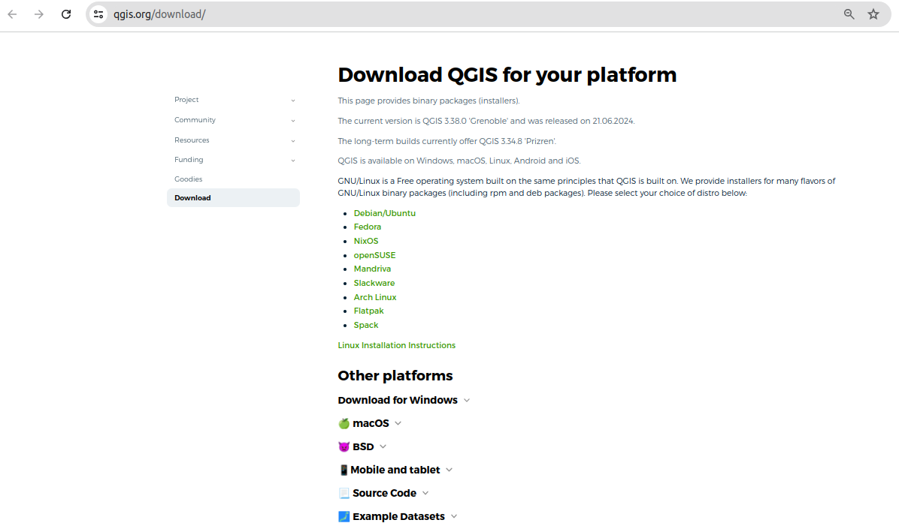
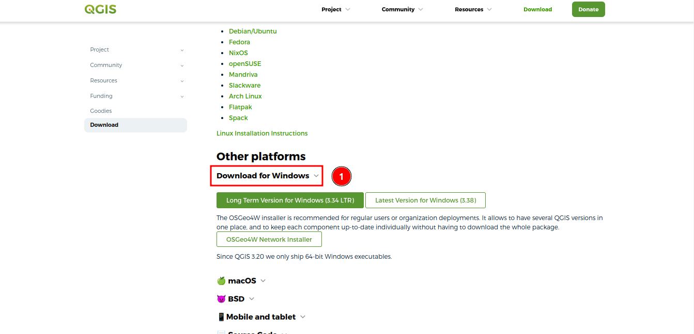

# Quick Start Documentation

The following Quick Start documentation will guide users on how to set up the tool with its dependencies:

1. Get QGIS.
2. The project file for an area of interest.
3. Sign in for a Planet NICFI account.
4. get the Plantet_Explorer Plugin.
5. get the GEA Re-Afforestation Plugin

## 1. How to install QGIS:

- **Step 1: Visit the QGIS Website:** Open your web browser and go to the QGIS official website: [QGIS Download Page](https://www.qgis.org/download/).

- **Step 2: Choose Your Operating System:** On the download page, you will see options for different operating systems (Windows, macOS, Linux, etc.). Select the download option that matches your operating system.

    Click on the 1️⃣ `Download for Windows`. To view the versions available for download.

    - **Choose Your Version:** On the download page, you will see multiple versions of QGIS. Choose the version that is recommended for your needs. Generally, the Long Term Release (LTR) is recommended for most users as it is the most stable version. Download the LTR.

    

- **Step 3: Installing QGIS**

Once the download is complete, locate the downloaded file in your Downloads folder or the location you specified. Double-click the installer file to start the installation process.

## Follow the Installation Wizard:

- The QGIS Setup Wizard will open. Follow the prompts: Click `Next` to start the installation process.

- The second window will include all the licenses that you have to agree with in order to get `QGIS` installed. Check the 1️⃣ `I accept the terms in the License Agreement` box then click on the 2️⃣ `Next` button.

- Next, you will be prompted to select the install location. This is the same thing as the installation path and this is where your QGIS version will be installed. It is recommended to go with the default one which is `C:\Program Files\QGIS 3.34` for Windows. Please note that the QGIS version number may vary based on the current LTR.

- Select the components you wish to install. For a full installation, leave all options checked and click `Next`.

- Click `Install` to begin the installation.

- Complete the Installation: The installer will copy the necessary files to your computer. This process may take a few minutes. Once the installation is complete, click `Finish` to exit the Setup Wizard.

## Launch QGIS:
You can now launch QGIS from your Start menu or desktop shortcut.

## Additional Notes

## For MacOS Users

If you are using macOS, follow the instructions provided here:

When attempting to launch QGIS for the first time on macOS, there is a chance that macOS will `initially block it due to its origin from the internet. To enable its execution, follow these steps:

1. Navigate to `System Preferences`.
2. Select `Security & Privacy`.
3. In the `General` tab, you will encounter a notification indicating that QGIS is being blocked. Click on the `Open Anyway` button.

4. A confirmation dialog will pop up. Click `Open` to commence QGIS.

## For Non-Administrators:

When installing QGIS, it's essential to select an installation directory where you have write access on your computer. During the installation process, you will be prompted to choose the installation directory. To ensure successful installation without administrator privileges, specify a path within your user directory or any location where you have the necessary write access. This allows you to use the QGIS on your system effectively while bypassing the need for administrative permissions.

By following these steps, you can quickly download and install QGIS on your Windows system and get started with your GIS projects.

## 2. Accessing Project Data (The project file for an area of interest):

- **Project Folder Delivery:** You need to ask for the project folder from your head office containing all the necessary data for your project. 

### This folder will include:

- **Landsat Images:** These images will be stored within the project folder.

- **Vector Data Layers:** All required vector data layers will also be included in the project folder.

### Streaming Additional Imagery

- **NICFI and Google Imagery:** The `NICFI` and `Google` imagery are not stored locally but are streamed directly into the project. To access this streamed imagery, you need the Planet Explorer plugin installed and configured in QGIS.

## 3. Sign in for a Planet NICFI account:

The user must sign in to the Planet NICFI account to stream the NICFI imagery. For detailed documentation on the sign-in for a Planet NICFI account click [here](../manual/login.md)

## 4. How to install Planet_Explorer Plugin

*QGIS, short for Quantum Geographic Information System, is a free and open-source software used for working with geospatial data. This data can be easily edited and analysed within QGIS. As a cross-platform application, it is widely used in geographic data applications and runs on different operating systems, including Windows, Mac, and Linux. QGIS is written in Python, C++, and Qt.

### Steps to Install the Plugin

- **Open QGIS:** Launch the QGIS application on your computer.

- **Access the Plugins Menu:** Click on the 1️⃣ `Plugins` option available in the navbar section at the top of the QGIS window. Upon clicking you will see the other option for plugin.

- **Manage and Install Plugins** Select the 1️⃣ `Manage and Install Plugins..` option from the dropdown menu.

- **Search for the Plugin:** In the Plugin Manager window, click on the 1️⃣ search bar and type Planet_explorer.

- **Select and Install:** Once you find the Planet_explorer plugin in the search results, select it by clicking on the 1️⃣ `Planet_Explorer` and then click on the 2️⃣ `Install Plugin` button.

After the installation, you will see the login option.

After installing the plugin you will see the option for login to the `Planet Explorer` site. register to the site and log in to view Norway’s International Climate & Forests Initiative (NICFI), imagery.

Click on the [sign-up](../manual/sign-up.md) to view the detailed documentation on how to sign up on the `Planet Explorer` site.

Click on the [login](../manual/login.md) to view the detailed documentation on how to log in on the `Planet Explorer` site.

### Login

Click on the login button and login to the planet explorer. Upon logging in you will see options like upload, draw, select or extent layers.

### Loading the Project

To use this data you need to upload it to the plugin. Click on the 1️⃣ `Upload` button, and select the `GTI-GEA-Malawi 2.qgz` file from the system. This file will automatically load all the Landsat images and vector data layers from the project folder.

### Handling Unavailable Layers

- **Handle Unavailable Layer Pop-up:** If any layer is unavailable, you will see the `Handle Unavailable Layer` pop-up.

- **Keep Unavailable Layers:** Click on the 1️⃣ `Keep Unavailable Layers` option to continue.

    

- **Successful Upload:** On successful upload, you will see the data loaded into QGIS.

    

### Streaming NICFI and Google Imagery

Accessing Streamed Imagery: With the Planet Explorer plugin installed, the NICFI and Google imagery will be streamed into your QGIS project, allowing you to view and analyse this data alongside your locally stored Landsat images and vector data layers.

## 5. How to install GEA Re-Afforestation Plugin

The GEA Re-Afforestation Tool consists of two main components:

1. A QGIS project that contains all the data for the area of interest, such as Malawi.
2. The GEA Re-Afforestation Plugin helps users easily view current, recent, and historical imagery of an area and conveniently draw boundaries for proposed re-afforestation projects.

To use the tool, a few dependencies are required:

1. QGIS: The tool runs in QGIS geographical software, which needs to be installed on the user's computer.
2. A free Account for NICFI data: https://www.planet.com/nicfi
3. Planet_explorer: Some data (e.g., NICFI imagery) is streamed in via the Planet plugin, so this plugin needs to be installed in QGIS.

You must have the plugin URL. To get the plugin URL go to the [Plugins GitHub Repository](https://github.com/kartoza/qgis-gea-plugin)

### Steps to Install the Plugin

- **Open QGIS:** Launch the QGIS application on your computer.

- **Access the Plugins Menu:** Click on the 1️⃣ `Plugins` option available in the navbar section at the top of the QGIS window. Upon clicking you will see the other option for plugin.

- **Manage and Install Plugins** Select the 1️⃣ `Manage and Install Plugins..` option from the dropdown menu.

- **Add Plugin URL:** Click on the 1️⃣ `Settings` option and then click on the 2️⃣ `Add` button to add the plugin URL.

Upon clicking the pop-up will open to add the URL. Enter the 1️⃣ `Name` and 2️⃣ `URL` in the respective fields. Click on the 3️⃣ `OK` button, to add the plugin.

You will see the plugin is added successfully.

- **Install Plugin:** To install the plugin click on the 1️⃣ `All` option and search for the  2️⃣ `QGIS GEA afforestation tool` plugin. Click on the 3️⃣ `Plugin` name, to enable the install button and then click on the 4️⃣ `Install` button, to install the plugin.

After successful installation, you will see the plugin icon.

## Conclusion

By following the steps outlined in this Quick Start Guide, you will be able to set up your environment for effective use of plugins, access essential project data, and install necessary plugins like Planet_Explorer. This setup will enable you to view, analyse, and manage geospatial data, including streamed imagery from NICFI and Google, as well as local data like Landsat images and vector data layers.
