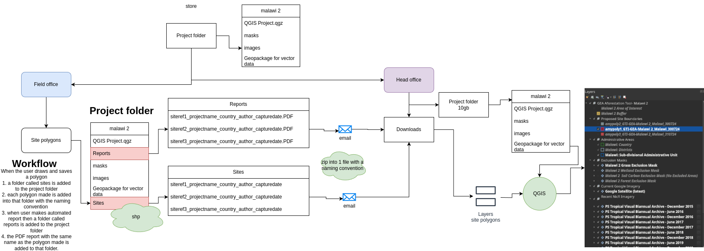

# User Workflow Document

## Project Folder Overview

The project folder is stored at the `Head office` and can be downloaded by the `Field Office`. The folder should contain:

- Masks
- Images
- Package for vector data
- QGIS project file (project.qgz)

## Field Office User

1. **Downloading the Project Folder:** Access and download the project folder from the Head office.

2. **Working with the Plugin:** Use the downloaded data and the plugin to perform projects.

### Sites Folder

**Creation of Polygons:** When you draw and save a polygon, a folder named `Sites` is created within the project folder. Each polygon is saved in this folder following a specific naming convention. The `Sites` folder contains the (.shp) files for each polygon.

### Reports Folder

**Generating Reports:** Automated reports generate a folder named `Reports` within the project folder. Each report is a PDF file named after the corresponding polygon. The `Reports` folder includes the PDF files of the automated reports.

### Naming Convention

Polygon names should follow the format: site-reference_project-name_country_creation date. This convention helps in analysing and identifying polygons.

**Sending Data to Head Office:** After completing the project, send only the `Sites` and `Reports` folders to the Head Office via email.

## Head Office

1. **Receiving and Storing Data:** Download the `Sites` and `Reports` folders sent by the Field Office via email. Add these folders to the project directory.

2. **Analysing and Visualising Projects:** Open the project in the plugin for further analysis or visualisation of the data.

By following these workflows, both the Field Office and Head Office can efficiently manage and process the project data, ensuring timely updates, accurate reporting, and streamlined collaboration between teams.
